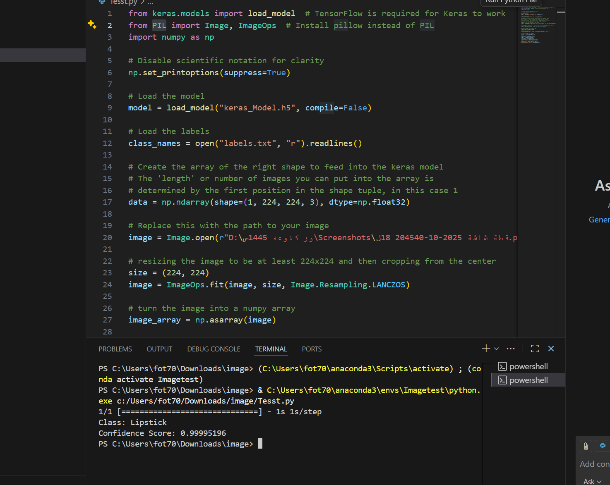

# 🧠 Image Classification Project

This project uses a **Keras model** trained with Teachable Machine to classify images.

---

## 🖼️ Screenshot of the Output

## Download

You can download the full project as a ZIP file here:  

[project_files.zip](converted_keras.zip)

- `test.py` — Python script that loads the trained model and runs image classification.
